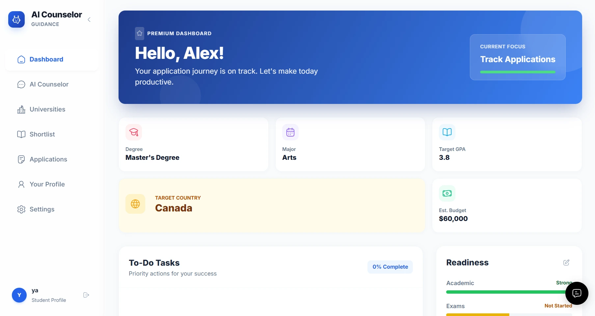

# 🎓 AI Counsellor


<p align="center">


</p>

---

## 📖 Overview

**AI Counsellor** is an intelligent study abroad platform that helps students make informed decisions about their higher education journey.

Instead of manually searching through hundreds of universities, students simply complete their profile and chat with the AI counsellor.

The AI analyzes academic records, preferences, goals, budget, and destination to recommend suitable universities, provide guidance, and simplify the admission process.

---

# ✨ Features

### 🤖 AI Counsellor

- AI-powered chat assistant
- Personalized study abroad guidance
- Answers admission-related questions
- Helps choose countries and universities
- Provides career recommendations

---

### 👤 Smart Student Profile

Students can create their complete profile including:

- Academic Details
- English Test Scores
- Budget
- Preferred Countries
- Intake
- Program
- Work Experience
- Interests

The AI uses this information to generate highly personalized recommendations.

---

### 🎯 AI University Recommendation

Based on the student's profile, AI recommends universities by considering:

- Academic performance
- IELTS/PTE/TOEFL score
- Budget
- Preferred country
- Preferred intake
- Program eligibility
- Previous education
- Admission requirements

---

### ❤️ University Shortlisting

- Save favorite universities
- Compare universities
- Track shortlisted colleges
- Manage applications

---

### 📄 Application Management

Students can

- Submit applications
- Track progress
- View application status
- Update profile information

---

### 🔐 Authentication

- Secure Login
- Registration
- Protected Routes
- Session Management
- Authentication using Supabase

---

### 📱 Responsive UI

- Desktop
- Tablet
- Mobile

---

# 📸 Screenshots


## Student Dashboard




---

# 🏗 Project Structure

```
src
│
├── assets
│
├── ai
│   └── AIChat.tsx
│
├── components
│   ├── GlobalLoader.tsx
│   └── ProtectedRoute.tsx
│
├── layouts
│   └── DashboardLayout.tsx
│
├── lib
│   ├── api.ts
│   ├── events.ts
│   ├── schemas.ts
│   ├── supabase.ts
│   └── types.ts
│
├── pages
│   ├── application
│   ├── auth
│   ├── counselor
│   ├── dashboard
│   ├── landing
│   ├── onboarding
│   ├── profile
│   ├── shortlist
│   └── universities
│
├── store
├── styles
│
├── App.tsx
├── main.tsx
└── theme.ts
```

---

# 🧠 AI Workflow

```text
Student Creates Profile
            │
            ▼
AI Reads Student Information
            │
            ▼
Analyzes Academic Background
            │
            ▼
Checks Budget & Preferences
            │
            ▼
Matches University Requirements
            │
            ▼
Suggests Best Universities
            │
            ▼
Student Shortlists Universities
            │
            ▼
Application Process
```

---

# ⚙️ Tech Stack

## Frontend

- React
- TypeScript
- Vite
- Tailwind CSS

## Backend

- Supabase
- PostgreSQL
- Authentication
- Row Level Security

## UI

- Material UI
- Responsive Design

## AI

- AI Chat Assistant
- Personalized Recommendation Engine
- Profile Analysis
- Intelligent Guidance

---

# 🚀 Installation

Clone the repository

```bash
git clone https://github.com/Gaurav-023/ai-counsellor.git
```

Move into project

```bash
cd ai-counsellor
```

Install dependencies

```bash
npm install
```

Start development server

```bash
npm run dev
```

Build production

```bash
npm run build
```

Preview production

```bash
npm run preview
```

---

# 🔑 Environment Variables

Create a `.env` file

```env
VITE_SUPABASE_URL=YOUR_SUPABASE_URL

VITE_SUPABASE_ANON_KEY=YOUR_SUPABASE_ANON_KEY

VITE_AI_API_KEY=YOUR_AI_API_KEY
```

---

# 📂 Core Modules

| Module | Description |
|---------|-------------|
| AI Chat | Student guidance using AI |
| Authentication | Login & Registration |
| Dashboard | Student overview |
| Profile | Student information |
| Universities | Browse universities |
| Shortlist | Save universities |
| Applications | Manage admission applications |

---

# 🎯 Future Improvements

- AI Scholarship Recommendation
- AI SOP Generator
- AI Resume Builder
- AI Visa Guidance
- AI Document Verification
- University Comparison
- Course Recommendation Engine
- Live Counsellor Chat
- Email Notifications
- Interview Preparation

---

# 📈 Project Highlights

- AI-Powered Student Counselling
- Smart University Recommendation
- Profile-Based Matching
- Responsive Dashboard
- Secure Authentication
- Modern UI
- Scalable Architecture
- Type Safe Codebase
- Fast Performance using Vite
- PostgreSQL Database

---

# 🤝 Contributing

Contributions are welcome!

1. Fork the repository

2. Create a feature branch

```bash
git checkout -b feature/new-feature
```

3. Commit changes

```bash
git commit -m "Added new feature"
```

4. Push

```bash
git push origin feature/new-feature
```

5. Open a Pull Request

---

# 👨‍💻 Developer

**Gaurav**

Full Stack Developer

- React.js
- TypeScript
- Flutter
- Supabase
- PostgreSQL
- AI Applications

GitHub

https://github.com/Gaurav-023

---

# ⭐ Support

If you found this project helpful, consider giving it a ⭐ on GitHub.

It motivates future development and helps others discover the project.

---

## 📜 License

This project is licensed under the **MIT License**.
